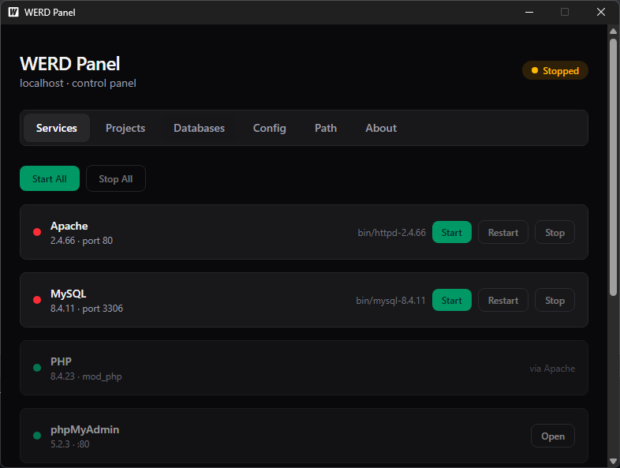

# WERD Panel

Alternatif XAMPP/Laragon: panel kontrol Apache + PHP + MySQL + phpMyAdmin
untuk Windows.

> **Moto** — Hanya mengubah yang ada di dalam folder. 100% tidak ada setting
> atau penaruhan file ke luar folder.



## Versi yang Disertakan

| Komponen   | Versi                                  | Keterangan          |
| ---------- | -------------------------------------- | ------------------- |
| Apache     | 2.4.66 (VS17)                          | `httpd.exe`         |
| PHP        | 8.4.24 (TS, VS17 x64)                  | mod_php             |
| MySQL      | 8.4.11 (winx64)                        | port 3306           |
| phpMyAdmin | 5.2.3 (english)                        | DocumentRoot :8080  |

## Isi Archive (`werd-windows-x64.zip`)

Extract ke folder mana saja — path dikonfigurasi otomatis mengikuti lokasi `werd.exe`.

```
werd-<versi>/
├── bin/                                  # runtime (diunduh saat build)
│   ├── httpd-2.4.66-251206-Win64-VS17/   # Apache 2.4.66
│   │   └── Apache24/
│   │       ├── bin/
│   │       │   └── httpd.exe             # server Apache
│   │       └── conf/httpd.conf           # disalin dari config/ saat start
│   ├── php-8.4.23-Win32-vs17-x64/        # PHP 8.4 (TS, mod_php)
│   │   ├── php8apache2_4.dll
│   │   ├── php.ini                       # disalin dari config/ saat start
│   │   └── ext/
│   ├── mysql-8.4.11-winx64/              # MySQL 8.4.11
│   │   ├── bin/mysqld.exe
│   │   └── my.ini                        # disalin dari config/ saat start
│   └── phpMyAdmin-5.2.3-english/         # phpMyAdmin 5.2.3 (DocumentRoot)
├── config/                               # sumber kebenaran konfigurasi
│   ├── httpd.conf
│   ├── php.ini
│   ├── my.ini
│   └── config.inc.php
├── var/
│   ├── logs/                             # apache.log, mysql.log, ...
│   └── mysql/                            # datadir MySQL (dibuat saat init)
├── werd.exe                              # biner panel (port 8090) + frontend embed
└── README.md
```

Catatan:
- **Frontend (dashboard web) ter-embed** di dalam `werd.exe` — tidak perlu folder
  `web/dist` terpisah.
- Start/stop service ditangani langsung dari panel (`werd.exe`), dan saat
  aplikasi ditutup Apache + MySQL otomatis di-stop.

## Menjalankan

```bash
werd.exe
```

- Panel kontrol : http://127.0.0.1:8090
- phpMyAdmin   : http://127.0.0.1:8080
- MySQL        : port 3306

`werd.exe` menyajikan dashboard, WebSocket `/ws`, kontrol start/stop per
service (Start/Stop All, status PID/CPU/RAM), dan log real-time (mirip XAMPP).
